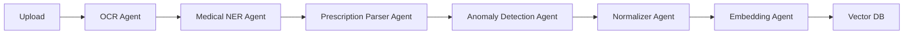
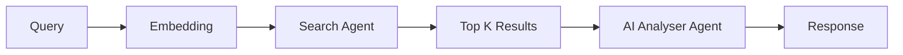

# MediSense Google ADK Agents

## Overview

This directory contains the **multi-agent system** for MediSense, built with Google's Gemini models. The system implements intelligent medical document processing and semantic search capabilities through specialized AI agents.

## Agent Architecture

### 🔄 Agent Workflow

#### Patient Flow (Document Processing)


#### Smart Search Flow


## Agent Descriptions

### 1. OCR Agent (`ocr_agent.py`)
**Purpose:** Extract text from medical document images

**Key Features:**
- Gemini Vision multimodal processing
- Multi-language support (English, Hindi, regional)
- Document type identification
- Quality assessment
- Metadata extraction

**Input:**
```python
{
    'file_path': 'path/to/document.pdf',
    'patient_id': 'patient-uuid'
}
```

**Output:**
```python
{
    'success': True,
    'document_type': 'lab_report',
    'extracted_text': 'Full document text...',
    'metadata': {
        'patient_name': 'John Doe',
        'document_date': '2024-01-15',
        'confidence': 0.95
    },
    'quality_assessment': {...}
}
```

---

### 2. Medical NER Agent (`medical_ner_agent.py`)
**Purpose:** Extract medical entities from text

**Entity Categories:**
- 🩺 Diseases/Conditions
- 💊 Medications
- 🧪 Biomarkers/Lab Values
- 😷 Symptoms
- 🏥 Procedures
- ❤️ Vital Signs
- ⚠️ Allergies

**Input:**
```python
{
    'text': 'Patient has Type 2 Diabetes, prescribed Metformin 500mg BD...',
    'patient_id': 'patient-uuid',
    'document_type': 'prescription'
}
```

**Output:**
```python
{
    'success': True,
    'entities': {
        'diseases': [
            {
                'name': 'Diabetes Mellitus Type 2',
                'icd10_code': 'E11',
                'status': 'active'
            }
        ],
        'medications': [
            {
                'name': 'Metformin',
                'dosage': '500',
                'unit': 'mg',
                'frequency': 'BD'
            }
        ],
        'biomarkers': [...]
    }
}
```

---

### 3. Prescription Parser Agent (`prescription_parser_agent.py`)
**Purpose:** Parse Indian prescription formats

**Specializations:**
- Indian dosage patterns (1-0-1, 1-1-1, OD, BD, TDS)
- Medical abbreviations (AC, PC, HS, PRN, SOS)
- Complete medication details
- Refill calculations

**Input:**
```python
{
    'text': 'Prescription OCR text...',
    'patient_id': 'patient-uuid'
}
```

**Output:**
```python
{
    'success': True,
    'medications': [
        {
            'drug_name': 'Metformin',
            'strength': '500',
            'unit': 'mg',
            'frequency': {
                'code': 'BD',
                'pattern': '1-0-1',
                'times_per_day': 2
            },
            'duration': {'value': 30, 'unit': 'days'}
        }
    ],
    'diagnosis': {...},
    'follow_up': {...}
}
```

---

### 4. 7-Layer Anomaly Detection Agent (`anomaly_detection_agent.py`)
**Purpose:** Comprehensive medical anomaly detection

**Detection Layers:**
1. **Range Check** - Compare against normal values
2. **Critical Values** - Life-threatening thresholds
3. **Age-Adjusted** - Age-specific ranges
4. **Medication Context** - Drug interactions
5. **Trend Analysis** - Historical comparisons
6. **Comorbidity Patterns** - Disease combinations
7. **Risk Scoring** - Overall risk (0-100)

**Input:**
```python
{
    'patient_id': 'patient-uuid',
    'current_record': {...},
    'historical_records': [...],
    'patient_metadata': {
        'age': 45,
        'conditions': ['Diabetes', 'Hypertension']
    }
}
```

**Output:**
```python
{
    'success': True,
    'overall_severity': 65,
    'has_critical_alerts': True,
    'anomalies': [
        {
            'layer': 'Layer 2: Critical Value Detection',
            'severity': 85,
            'is_critical': True,
            'title': 'Severe Hyperglycemia',
            'recommendation': 'Immediate ED visit required'
        }
    ],
    'priority_actions': [...]
}
```

---

### 5. Medical Records Normalizer Agent (`normalizer_agent.py`)
**Purpose:** Standardize and structure medical data

**Normalization Tasks:**
- Medical terminology standardization
- ICD-10, LOINC, RxNorm, SNOMED CT coding
- Date/time normalization (ISO 8601)
- Unit standardization
- Data completeness validation

**Input:**
```python
{
    'patient_id': 'patient-uuid',
    'ocr_output': {...},
    'ner_output': {...},
    'prescription_output': {...},
    'anomaly_output': {...}
}
```

**Output:**
```python
{
    'success': True,
    'normalized_record': {
        'record_metadata': {...},
        'clinical_data': {
            'diagnoses': [...],
            'medications': [...],
            'biomarkers': [...]
        }
    },
    'data_quality': {
        'completeness_score': 0.85,
        'confidence_score': 0.92
    }
}
```

---

### 6. Embedding Agent (`embedding_agent.py`)
**Purpose:** Create vector embeddings for semantic search

**Model:** Google text-embedding-004

**Features:**
- Document embedding creation
- Query embedding creation
- Similarity calculation
- Batch processing
- ChromaDB integration

**Input:**
```python
{
    'text': 'Medical record text...',
    'record_id': 'REC_20240115_123456',
    'metadata': {...}
}
```

**Output:**
```python
{
    'success': True,
    'embedding': [0.123, -0.456, ...],  # 768-dimensional vector
    'dimension': 768
}
```

---

### 7. Search Agent (`search_agent.py`)
**Purpose:** Intelligent hybrid search

**Search Modes:**
- **Semantic Search** - Vector similarity
- **Keyword Search** - Traditional text matching
- **Hybrid Search** - Combined ranking

**Ranking Factors:**
- Semantic similarity (60%)
- Keyword match (30%)
- Recency (10%)
- Clinical relevance bonus
- Anomaly severity bonus

**Input:**
```python
{
    'query': 'What is my HbA1c level?',
    'patient_id': 'patient-uuid',
    'top_k': 5,
    'search_mode': 'hybrid'
}
```

**Output:**
```python
{
    'success': True,
    'query_analysis': {...},
    'ranked_results': [
        {
            'record_id': 'REC_...',
            'relevance_score': 0.92,
            'summary': 'Lab report showing HbA1c...'
        }
    ]
}
```

---

### 8. AI Analyser Agent (`ai_analyser_agent.py`)
**Purpose:** Generate intelligent, evidence-based responses

**Response Types:**
- Direct Answer
- Trend Analysis
- Comprehensive Summary
- Medication Information
- Pattern Analysis

**Features:**
- Patient-friendly language
- Clinical terminology for providers
- Evidence citation
- Recommendation generation
- Medical disclaimers

**Input:**
```python
{
    'query': 'What is my current HbA1c?',
    'search_results': [...],
    'response_mode': 'patient'
}
```

**Output:**
```python
{
    'success': True,
    'response_type': 'direct_answer',
    'answer': 'Your most recent HbA1c is 7.2%...',
    'evidence': [
        {
            'record_id': 'REC_...',
            'date': '2024-01-15',
            'relevant_text': 'HbA1c: 7.2%'
        }
    ],
    'recommendations': [...],
    'confidence_score': 0.92,
    'disclaimer': '...'
}
```

---

## Orchestrator (`orchestrator.py`)

The **Agent Orchestrator** coordinates all agents and implements the two main flows:

### Usage Example

```python
from agents.orchestrator import AgentOrchestrator

# Initialize
orchestrator = AgentOrchestrator(
    vector_db_path='./chroma_db',
    collection_name='medical_records',
    api_key='your-google-api-key'
)

# Patient Flow: Process Document
result = orchestrator.process_patient_document(
    file_path='lab_report.pdf',
    patient_id='patient-123',
    patient_metadata={'age': 45, 'gender': 'M'}
)

print(f"Record ID: {result['record_id']}")
print(f"Severity: {result['overall_severity']}")

# Smart Search: Ask Question
search_result = orchestrator.smart_search(
    query='What is my HbA1c?',
    patient_id='patient-123',
    top_k=5
)

print(f"Answer: {search_result['response']}")
print(f"Evidence: {search_result['evidence']}")
```

## Configuration

### Environment Variables

```env
# Google API
GOOGLE_API_KEY=your-api-key-here
GEMINI_MODEL=gemini-2.0-flash-exp
EMBEDDING_MODEL=text-embedding-004

# Vector Database
VECTOR_DB_PATH=./chroma_db
VECTOR_DB_COLLECTION=medical_records
```

### Agent Configuration

Edit `config.py` to customize:

```python
class AgentConfig:
    # Model Selection
    DEFAULT_MODEL = 'gemini-2.0-flash-exp'

    # Temperature Settings
    OCR_TEMPERATURE = 0.1
    ANALYSER_TEMPERATURE = 0.4

    # Search Weights
    HYBRID_SEARCH_WEIGHTS = {
        'semantic': 0.6,
        'keyword': 0.3,
        'recency': 0.1
    }
```

## Testing Agents

### Test Individual Agent

```python
from agents.ocr_agent import OCRAgent

agent = OCRAgent(api_key='your-key')

result = agent.process({
    'file_path': 'test_document.pdf',
    'patient_id': 'test-123'
})

print(result)
```

### Test Full Pipeline

```python
from agents.orchestrator import AgentOrchestrator

orchestrator = AgentOrchestrator()

# Test document processing
result = orchestrator.process_patient_document(
    file_path='test_lab_report.pdf',
    patient_id='test-patient'
)

assert result['success'] == True
assert 'record_id' in result
```

## Prompts

Each agent has a detailed system prompt that defines its behavior. Prompts are located in the `get_system_prompt()` method of each agent class.

To customize agent behavior, edit the system prompts.

**Example: Customize OCR Agent**

```python
class OCRAgent(BaseAgent):
    def get_system_prompt(self) -> str:
        return """
        You are an expert Medical OCR Agent...
        [Customize instructions here]
        """
```

## Logging

Agents use Python's logging module. Configure in your app:

```python
import logging

logging.basicConfig(
    level=logging.INFO,
    format='%(asctime)s - %(name)s - %(levelname)s - %(message)s',
    handlers=[
        logging.FileHandler('logs/agents.log'),
        logging.StreamHandler()
    ]
)
```

Logs include:
- Agent initialization
- Processing steps
- Error messages
- Performance metrics

## Error Handling

All agents return standardized error responses:

```python
{
    'success': False,
    'error': 'Error message',
    'agent': 'OCR Agent',
    'timestamp': '2024-01-15T10:30:00'
}
```

## Performance Tips

1. **Batch Processing**: Use `batch_process_documents()` for multiple files
2. **Caching**: Implement result caching for frequently accessed data
3. **Async Processing**: Use async/await for parallel agent execution
4. **Model Selection**: Use `gemini-2.0-flash-exp` for speed
5. **Token Optimization**: Truncate long texts when appropriate

## Dependencies

See `requirements.txt` for full list:

```txt
google-generativeai>=0.3.0
chromadb>=0.4.0
Pillow>=10.0.0
numpy>=1.24.0
python-dotenv>=1.0.0
```

## Contributing

To add a new agent:

1. Create new file: `agents/my_agent.py`
2. Inherit from `BaseAgent`
3. Implement `get_system_prompt()` and `process()` methods
4. Add to orchestrator workflow
5. Update documentation

## License

See main project LICENSE file.

---

**Powered by Google Gemini 2.0 Flash** 🚀
